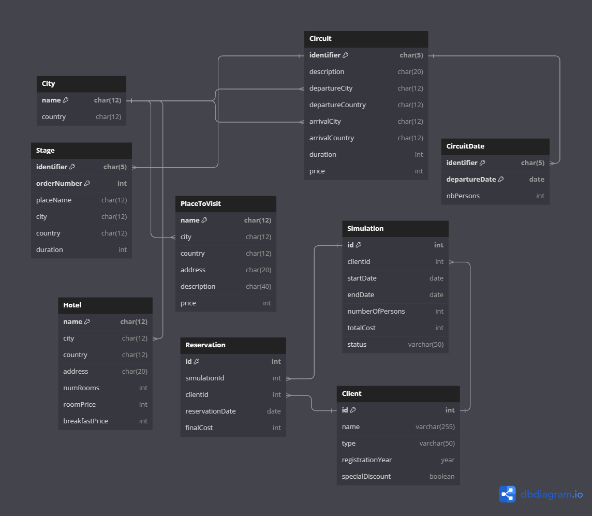

# Descripción

El proyecto consiste en realizar una solución para la Agencia de Viajes PONCHITO. Se desarrolló e implementó un Sistema de Base de Datos Relacional(SGDB relacional) para automatizar los procesos de la reservación de los viajes. La solución busca facilitar a la agencia la eficiente gestión de la información relacionada con sus viajes a ciudades, lugares, circuitos de viaje, hoteles y hacer simulaciones y reservaciones hechas por los clientes. Este sistema permite a los usuarios internos y externos hacer una simulación ajustada a sus preferencias y necesidades para después realizar una reservación. La aplicación soporta funciones para gestión de datos y transacciones implementando triggers para asegurar la coherencia y validez de las operaciones en la base de datos.

# Viabilidad

La viabilidad técnica, operativa y económica se basan en la tecnología de base de datos relacionales establecidas con MySQL. Al ser relacionales, se asegura un sistema robusto, seguro y de fácil mantenimiento. El proyecto optimiza los procesos de reservación y gestión de clientes, así puede realizarse una mejor experiencia para el cliente y operaciones eficientes en la agencia. Económicamente, al automatizar los procesos se reduce costos a largo plazo e igual disminuyen los errores humanos, permitiendo un auge en la capacidad y demanda. El desafío radica en la implementación correcta y adaptación del sistema a las necesidades de la agencia. Igual se busca la capacitación del personal para que se obtenga un buen aprovechamiento de la nueva herramienta.

# Objetivos, metas e hipótesis

## Objetivos

- Desarrollar e implementar un SGBD relacional para la Agencia de Viajes PONCHITO que soporte la gestión integral de la información de viajes, clientes, simulaciones y reservaciones.
- Mejorar la eficiencia de los procesos de reservación de viajes mediante la automatización y digitalización.
- Facilitar a los clientes la simulación y confirmación de reservaciones de viajes de manera intuitiva y segura.

## Metas

- Crear un esquema relacional y lógico robusto y escalable que refleje fielmente las operaciones y necesidades de la agencia.
- Implementar un conjunto de funciones y transacciones para la gestión eficiente de datos, con especial énfasis en la integridad y seguridad de estos.
- Desarrollar e integrar triggers en la base de datos para automatizar la validación de la disponibilidad de viajes y la coherencia de las reservaciones.

## Hipótesis

- La implementación de un sistema basado en SGBD relacional aumentará la satisfacción del cliente mediante procesos de reservación más rápidos y precisos.
- La automatización de la gestión de reservaciones y clientes reducirá errores operativos y costos asociados a la gestión manual.
- El sistema proporcionará una plataforma escalable y flexible que podrá adaptarse a futuras necesidades de expansión y diversificación de la agencia de viajes.

# Especificaciones técnicas

## Esquema UML



## Esquema lógico (pasar a anexo)

```sql
CREATE TABLE City (
                      name CHAR(12) PRIMARY KEY,
                      country CHAR(12)
);

CREATE TABLE PlaceToVisit (
                              name CHAR(12) PRIMARY KEY,
                              city CHAR(12),
                              country CHAR(12),
                              address CHAR(20),
                              description CHAR(40),
                              price INT
);

CREATE TABLE Circuit (
                         identifier CHAR(5) PRIMARY KEY,
                         description CHAR(20),
                         departureCity CHAR(12),
                         departureCountry CHAR(12),
                         arrivalCity CHAR(12),
                         arrivalCountry CHAR(12),
                         duration INT,
                         price INT
);

CREATE TABLE CircuitDate (
                             identifier CHAR(5),
                             departureDate DATE,
                             nbPersons INT,
                             PRIMARY KEY (identifier, departureDate)
);

CREATE TABLE Stage (
                       identifier CHAR(5),
                       orderNumber INT,
                       placeName CHAR(12),
                       city CHAR(12),
                       country CHAR(12),
                       duration INT,
                       PRIMARY KEY (identifier, orderNumber)
);

CREATE TABLE Hotel (
                       name CHAR(12) PRIMARY KEY,
                       city CHAR(12),
                       country CHAR(12),
                       address CHAR(20),
                       numRooms INT,
                       roomPrice INT,
                       breakfastPrice INT
);

CREATE TABLE Client (
                        id INTEGER PRIMARY KEY AUTO_INCREMENT,
                        name VARCHAR(255),
                        type VARCHAR(50),
                        registrationYear YEAR,
                        specialDiscount BOOLEAN DEFAULT FALSE
);

CREATE TABLE Simulation (
                            id INTEGER PRIMARY KEY AUTO_INCREMENT,
                            clientId INTEGER,
                            startDate DATE,
                            endDate DATE,
                            numberOfPersons INT,
                            totalCost INT,
                            status VARCHAR(50)
);

CREATE TABLE Reservation (
                             id INTEGER PRIMARY KEY AUTO_INCREMENT,
                             simulationId INTEGER,
                             clientId INTEGER,
                             reservationDate DATE,
                             finalCost INT
);

CREATE INDEX idx_place_city_country ON PlaceToVisit (city, country);

ALTER TABLE Simulation ADD FOREIGN KEY (clientId) REFERENCES Client (id);

ALTER TABLE Reservation ADD FOREIGN KEY (simulationId) REFERENCES Simulation (id);
ALTER TABLE Reservation ADD FOREIGN KEY (clientId) REFERENCES Client (id);

ALTER TABLE PlaceToVisit ADD FOREIGN KEY (city) REFERENCES City (name);

ALTER TABLE Circuit ADD FOREIGN KEY (departureCity) REFERENCES City (name);
ALTER TABLE Circuit ADD FOREIGN KEY (arrivalCity) REFERENCES City (name);

ALTER TABLE Hotel ADD FOREIGN KEY (city) REFERENCES City (name);

ALTER TABLE CircuitDate ADD FOREIGN KEY (identifier) REFERENCES Circuit (identifier);

ALTER TABLE Stage ADD FOREIGN KEY (identifier) REFERENCES Circuit (identifier);
```

## Triggers

Para la base de datos MySQL de "Agencia de Viajes PONCHITO", es importante adaptar los disparadores para alinearlos con el idioma de la base de datos y de la aplicación.

1. **Disparador para asegurar combinaciones únicas de ciudad-país en `PlaceToVisit`**
   Este disparador evita la inserción de un lugar para visitar en una ciudad que no esté ya listada en la tabla `City` o asegura que las combinaciones de ciudad-país sean consistentes.

    ```sql
    DELIMITER //
    
    CREATE TRIGGER CheckCityCountryConsistency BEFORE INSERT ON PlaceToVisit
    FOR EACH ROW
    BEGIN
      DECLARE city_count INT;
      SELECT COUNT(*) INTO city_count FROM City WHERE name = NEW.city AND country = NEW.country;
      IF city_count = 0 THEN
        SIGNAL SQLSTATE '45000' SET MESSAGE_TEXT = 'La combinación de ciudad-país no existe.';
      END IF;
    END;
    
    DELIMITER ;
    
    ```

2. **Disparador para actualizar automáticamente las descripciones de lugares en `PlaceToVisit`**
   Actualiza automáticamente las descripciones para incluir información sobre el precio cuando se agrega o actualiza un nuevo lugar.

    ```sql
    DELIMITER //
    
    CREATE TRIGGER UpdatePlaceDescription BEFORE INSERT ON PlaceToVisit
    FOR EACH ROW
    BEGIN
      SET NEW.description = CONCAT(NEW.description, ' - Precio: $', NEW.price);
    END;
    
    DELIMITER ;
    
    ```

3. **Disparador para validar las duraciones de `Circuit`**
   Asegura que la duración de un circuito no exceda un límite establecido por razones de viabilidad operativa.

    ```sql
    DELIMITER //
    
    CREATE TRIGGER ValidateCircuitDuration BEFORE INSERT ON Circuit
    FOR EACH ROW
    BEGIN
      IF NEW.duration > 30 THEN  -- Suponiendo que la duración máxima permitida es de 30 días
        SIGNAL SQLSTATE '45000' SET MESSAGE_TEXT = 'La duración del circuito excede el límite máximo permitido.';
      END IF;
    END;
    
    DELIMITER ;
    
    ```

4. **Disparador para actualizar el precio del circuito al actualizar**
   Este disparador asegura que cada vez que se actualiza la duración u otros parámetros de un circuito, el precio se ajusta en consecuencia (suponiendo que el precio depende de la duración).

    ```sql
    DELIMITER //
    
    CREATE TRIGGER UpdateCircuitPrice AFTER UPDATE ON Circuit
    FOR EACH ROW
    BEGIN
      IF OLD.duration <> NEW.duration THEN
        UPDATE Circuit SET price = NEW.duration * 100 WHERE identifier = NEW.identifier;  -- Cálculo de precio de ejemplo
      END IF;
    END;
    
    DELIMITER ;
    
    ```

5. **Disparador para actualizar el estado y costo de la reserva**
   Asegura que cuando se realiza una reserva, el estado y el costo total en la tabla `Simulation` se actualizan.

    ```sql
    DELIMITER //
    
    CREATE TRIGGER UpdateReservationStatus AFTER INSERT ON Reservation
    FOR EACH ROW
    BEGIN
      UPDATE Simulation SET status = 'Reservado', totalCost = NEW.finalCost WHERE id = NEW.simulationId;
    END;
    
    DELIMITER ;
    
    ```


## Funciones del sistema(transacciones)

### 1. Consulta del Folleto

### Transacciones Necesarias:

- **Selección de Ciudades y Países**: Obtener todas las ciudades y países disponibles.

    ```sql
    BEGIN;
    SELECT name, country FROM City;
    COMMIT;
    
    ```

- **Consulta de Circuitos por Ciudad**: Mostrar los circuitos disponibles en una ciudad específica.

    ```sql
    BEGIN;
    SELECT * FROM Circuit WHERE departureCity = 'nombre_ciudad';
    COMMIT;
    
    ```

- **Consulta de Hoteles en una Ciudad**: Listar todos los hoteles en una ciudad seleccionada.

    ```sql
    BEGIN;
    SELECT * FROM Hotel WHERE city = 'nombre_ciudad';
    COMMIT;
    
    ```


### 2. Simulación de una Reservación de Viaje

### Transacciones Necesarias:

- **Crear un Cliente Potencial**:

    ```sql
    BEGIN;
    INSERT INTO Client (name, type, registrationYear) VALUES ('nombre_cliente', 'tipo_cliente', YEAR(CURDATE()));
    SELECT LAST_INSERT_ID() AS newClientId;
    COMMIT;
    
    ```

- **Crear Simulación de Viaje**:

    ```sql
    BEGIN;
    INSERT INTO Simulation (clientId, startDate, endDate, numberOfPersons, totalCost, status)
    VALUES (id_cliente, 'fecha_inicio', 'fecha_fin', num_personas, costo_total, 'Pendiente');
    SELECT LAST_INSERT_ID() AS newSimulationId;
    COMMIT;
    
    ```


### 3. Reservación de un Viaje

### Transacciones Necesarias:

- **Confirmar Información del Cliente y Crear Reservación**:

    ```sql
    BEGIN;
    UPDATE Client SET name = 'nuevo_nombre' WHERE id = id_cliente;
    INSERT INTO Reservation (simulationId, clientId, reservationDate, finalCost)
    VALUES (id_simulacion, id_cliente, CURDATE(), costo_final);
    SELECT LAST_INSERT_ID() AS newReservationId;
    COMMIT;
    
    ```


# Normativa y reglamentos(ISO/IEC 12207:2008)

### **1. Proceso de Adquisición**

- **Propósito:** En este proyecto, el proceso de adquisición puede referirse a la selección y adquisición de tecnologías de software, servicios de hosting, o componentes de software de terceros que podrían necesitarse para soportar el sistema de reservaciones.
- **Actividades Relacionadas:**
    - **Preparación de requisitos de adquisición:** Definir claramente los requisitos técnicos y funcionales que deben cumplir los proveedores.
    - **Selección de proveedor:** Elegir proveedores basados en criterios establecidos, incluyendo fiabilidad, soporte y compatibilidad con las necesidades del proyecto.

### **2. Proceso de Desarrollo**

- **Propósito:** El desarrollo abarca desde la planificación inicial hasta las pruebas del sistema completado, pasando por el análisis de requisitos, diseño, implementación y verificación.
- **Actividades Relacionadas:**
    - **Análisis de Requisitos del Sistema y del Software:** Identificar y documentar las necesidades que el software debe cumplir, especialmente en términos de gestión de reservaciones y simulaciones de viajes, como se especificó en los requisitos del proyecto.
    - **Diseño del Sistema y del Software:** Estructurar la arquitectura de la base de datos y definir las interacciones entre los distintos componentes del sistema, asegurando la coherencia y la eficiencia en las operaciones de la base de datos.
    - **Implementación y Verificación del Software:** Codificar la base de datos, implementar funciones y triggers, y realizar pruebas para verificar que todos los componentes funcionen correctamente y cumplan con los requisitos definidos.

### **3. Proceso de Mantenimiento**

- **Propósito:** Asegurar que la aplicación siga siendo funcional y eficaz después de su despliegue, haciendo ajustes, mejoras y correcciones según sea necesario.
- **Actividades Relacionadas:**
    - **Análisis de Problemas y Modificaciones:** Monitorear y evaluar el rendimiento del sistema para identificar problemas o áreas de mejora.
    - **Implementación de Cambios:** Aplicar actualizaciones y mejoras para adaptar la aplicación a nuevas necesidades de la agencia o cambios en el entorno tecnológico.

### **4. Proceso de Soporte**

- **Propósito:** Proporcionar servicios de soporte necesarios para el desarrollo y mantenimiento eficaz del software.
- **Actividades Relacionadas:**
    - **Gestión de la Configuración:** Controlar las versiones del software y la configuración de la base de datos para evitar conflictos y pérdidas de datos durante las actualizaciones.
    - **Aseguramiento de la Calidad del Software:** Verificar y validar continuamente el software para asegurar que cumple con los estándares de calidad necesarios.

### **5. Proceso de Operación**

- **Propósito:** Operar efectivamente el sistema en un entorno de producción, asegurando que cumple con los objetivos para los que fue diseñado.
- **Actividades Relacionadas:**
    - **Operación del Sistema:** Manejar la operación diaria de la aplicación, incluyendo la supervisión del rendimiento y la respuesta a las necesidades del usuario final.

# Metodología

Definición de clases (remover)

1. **City Class**

```java
public class City {
    private String name;
    private String country;

    // Constructors, getters, and setters will be added here
}

```

1. **PlaceToVisit Class**

```java
public class PlaceToVisit {
    private String name;
    private String city;
    private String country;
    private String address;
    private String description;
    private int price;

    // Constructors, getters, and setters will be added here
}

```

1. **Circuit Class**

```java
public class Circuit {
    private String identifier;
    private String description;
    private String departureCity;
    private String departureCountry;
    private String arrivalCity;
    private String arrivalCountry;
    private int duration;
    private int price;

    // Constructors, getters, and setters will be added here
}

```

1. **CircuitDate Class**

```java
import java.util.Date;

public class CircuitDate {
    private String identifier;
    private Date departureDate;
    private int nbPersons;

    // Constructors, getters, and setters will be added here
}

```

1. **Stage Class**

```java
public class Stage {
    private String identifier;
    private int orderNumber;
    private String placeName;
    private String city;
    private String country;
    private int duration;

    // Constructors, getters, and setters will be added here
}

```

1. **Hotel Class**

```java
public class Hotel {
    private String name;
    private String city;
    private String country;
    private String address;
    private int numRooms;
    private int roomPrice;
    private int breakfastPrice;

    // Constructors, getters, and setters will be added here
}

```

1. **Client Class**

```java
public class Client {
    private int id;
    private String name;
    private String type;
    private int registrationYear;
    private boolean specialDiscount;

    // Constructors, getters, and setters will be added here
}

```

1. **Simulation Class**

```java
import java.util.Date;

public class Simulation {
    private int id;
    private int clientId;
    private Date startDate;
    private Date endDate;
    private int numberOfPersons;
    private int totalCost;
    private String status;

    // Constructors, getters, and setters will be added here
}

```

1. **Reservation Class**

```java
import java.util.Date;

public class Reservation {
    private int id;
    private int simulationId;
    private int clientId;
    private Date reservationDate;
    private int finalCost;

    // Constructors, getters, and setters will be added here
}

```

# Resultados

resultados

# Conclusiones

conclusiones

# Referencias y bibliografía

triggers

transacciones

agencia de viajes

ISO/IEC 12207:2008